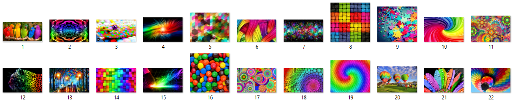

# DecolorNet_FusionNet_code
Variable Augmented Neural Network for Decolorization and Multi-Exposure Fusion

% Code is created based on the method described in the following paper:    
% Q. Liu, H. Leung.“Variable Augmented Neural Network for Decolorization and Multi-Exposure Fusion”    
% Information Fusion, vol. 46, pp.114-127, 2019.    
% Author: Q. Liu, H. Leung    
% Date : 22/4/2017    
% Version : 1.0    
% The code and the algorithm are for non-comercial use only.    
% Copyright 2017, University of Calgary.   
% The current version is not optimized.    

# Flowchart of the DecolorNet architecture
 
 
  
The whole method consists of the global-local contrast conversion stage and the image-gradient fusion stage. In the CNN procedure, both operators “Conv” and “ReLU” are included in the first and second layers, while only “Conv” exists in the third layer.   

## Demonstration of DecolorNet
  

## Demonstration of FusionNet
 

## Introduction of Wallpaper Dataset
These wallpaper images contain a variety of important structures such as large scale edges, smooth areas and fine textures, etc. Particularly, the average size of the dataset is 1254×1881, which is much larger than those of Cadik dataset and CSDD dataset. The average sizes of Cadik dataset and CSDD dataset are 292×352 and 356×406, respectively. The large size makes the conversion to be much more difficult than the Cadik dataset and CSDD dataset. It contains greater color complexity. The full collection of the dataset appears in the sub-folder of "Wallpapers_Dataset". 
     

## Other Related Projects
  * GcsDecolor: Gradient Correlation Similarity for Efficient Contrast Preserving Decolorization [**[Paper]**](https://ieeexplore.ieee.org/abstract/document/7088620)   [**[Code]**](https://github.com/yqx7150/GcsDecolor)

  * Log-Euclidean Metrics for Contrast Preserving Decolorization
[**[Paper]**](https://ieeexplore.ieee.org/document/8016668)   [**[Code]**](https://github.com/yqx7150/LeDecolor)

  * Semiparametric Decolorization With Laplacian-Based Perceptual Quality Metric
[**[Paper]**](https://ieeexplore.ieee.org/document/7456206)   [**[Code]**](https://github.com/yqx7150/SPDecolor)
