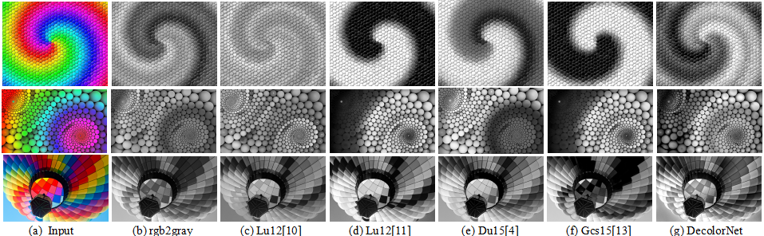

# DecolorNet_FusionNet_code
Variable Augmented Neural Network for Decolorization and Multi-Exposure Fusion

%% The Code is created based on the method described in the following paper:    
% [1] Q. Liu, H. Leung.“Variable Augmented Neural Network for Decolorization and Multi-Exposure Fusion”    
% Information Fusion, pp, 2018.    
% Author: Q. Liu, H. Leung    
% Date : 22/4/2017    
% Version : 1.0    
% The code and the algorithm are for non-comercial use only.    
% Copyright 2017, University of Calgary.   
% The current version is not optimized.    

# Flowchart of the DecolorNet architecture
 
 
  
The whole method consists of the global-local contrast conversion stage and the image-gradient fusion stage. In the CNN procedure, both operators “Conv” and “ReLU” are included in the first and second layers, while only “Conv” exists in the third layer.   

## Demonstration of DecolorNet
  

## Demonstration of FusionNet
 
